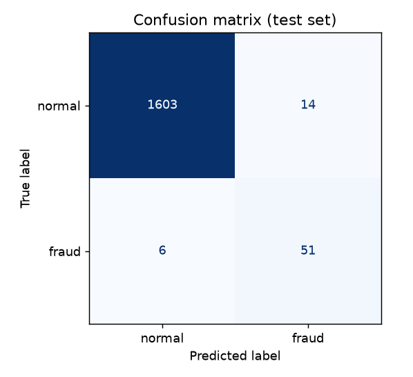
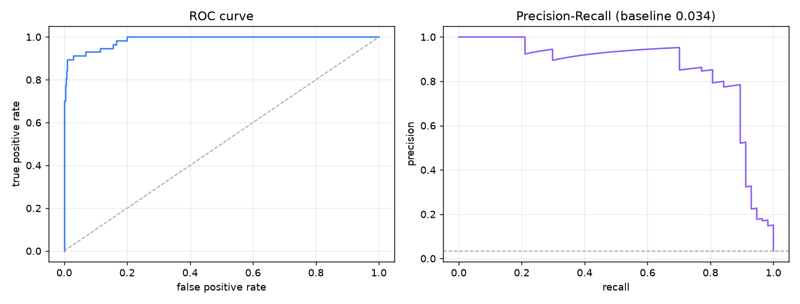
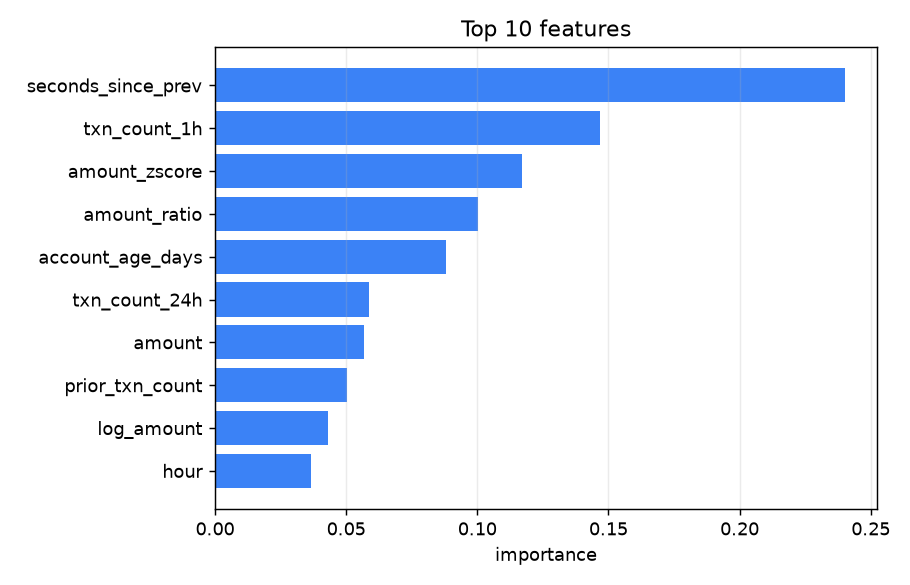

# Mini Banking System

A banking backend in Python + MySQL where the database enforces the rules: transfers are
ACID, concurrent access uses row-level locking, and an ML layer scores transactions for
fraud risk without being able to override any banking check.

No frontend, no ORM, no Docker. Raw SQL, ~3,000 lines of Python across 20 modules,
354 lines of SQL, MySQL 9.

## Schema

Seven tables: `customers`, `users`, `accounts`, `transfers`, `transactions`,
`beneficiaries`, `audit_logs`.

The core idea: `accounts` holds state, `transactions` holds history, and history is never
updated. `accounts.balance` is derivable from the ledger, but it's kept because you can't
`SELECT ... FOR UPDATE` a `SUM()` — you can only lock a physical row. `banking.reconcile()`
checks every stored balance against its ledger sum.

Money is `DECIMAL(15,2)`, never `FLOAT`. 16 CHECK constraints are active, including
`balance >= 0`, `amount > 0`, `from_account_id <> to_account_id`, and a check that a
ledger row's `balance_after` actually matches `balance_before ± amount`.

Two things the DB can't enforce and that live in `customers.py` instead: the 18+ age rule
(CHECK forbids `CURDATE()`) and "you can't add your own account as a beneficiary" (CHECK
can't contain subqueries).

## Transfers

`app/banking.py::transfer` runs inside one transaction: lock both accounts with
`SELECT ... FOR UPDATE` in `sorted()` account-id order, check status/limits/funds, score
risk, then write the transfer row, both balances, and two ledger legs. Commit on success,
rollback on any exception.

Locks are sorted so A→B and B→A can't hold what the other needs — that's what removes
deadlocks. Failed transfers are recorded on a second connection, since the rollback would
otherwise erase the `FAILED` row too.

## Results

**Race condition** (`demo race`) — two concurrent withdrawals of ₹800 and ₹700 against ₹1,000:

| | outcome | balance | total withdrawn | reconciles |
|---|---|---|---|---|
| no lock | both succeed | ₹300.00 | ₹1,500.00 | False |
| `FOR UPDATE` | one refused | ₹200.00 | ₹800.00 | True |

**Deadlocks** (`demo deadlock`) — 1 with each transaction locking its own source first, 0 with sorted order.

**Isolation** (`demo isolation`) — `REPEATABLE READ` doesn't see the other session's
commit; `READ COMMITTED` does.

**Rollback** (`demo rollback`) — crash injected after both balances were updated; balances
unchanged, 0 transfer rows left.

**Indexes** (`benchmark`) — 40 runs each, indexes dropped and recreated:

| query | without | with | speedup |
|---|---|---|---|
| `fraud_scan` | 3.21 ms | 0.21 ms | 15.4× (full scan → covering index) |
| `account_statement` | 0.89 ms | 0.57 ms | 1.57× |
| `daily_transfer_total` | 0.54 ms | 0.43 ms | 1.27× |

The big win is indexing a previously unindexed column. Adding `created_at` to a column
that already had an FK index is only 25–30%.

**Tests** — 34 passed in 6.5s.

After running the tests or `demo race`, `reconcile` reports exactly one mismatched
account. That's the account the unlocked-race test deliberately corrupts, and a test
asserts the corruption is there.

## ML layer

Binary classification on outgoing transactions. `ml/generate_data.py` produces 13,552
synthetic transactions across 77 accounts over 120 days (2.64% fraud) with four patterns:
amount spike, velocity, odd hour, and account drain.

15 features are built in SQL with window functions — historical average, amount ratio and
z-score, 1h/24h velocity, seconds since previous, hour, is_night, account age, and so on.
The historical average uses `ROWS BETWEEN UNBOUNDED PRECEDING AND 1 PRECEDING` so a
transaction is excluded from its own average.

Out-of-sample, time-based split:

| model | precision | recall | F1 | ROC-AUC | PR-AUC | accuracy |
|---|---|---|---|---|---|---|
| Logistic Regression (0.5) | 0.159 | 0.737 | 0.261 | 0.884 | 0.521 | 0.858 |
| Random Forest (0.5) | 0.785 | 0.895 | 0.836 | 0.985 | 0.856 | 0.988 |
| always predict NORMAL | 0.000 | 0.000 | 0.000 | 0.500 | — | 0.966 |

That last row is why accuracy is the wrong metric here: predicting "normal" every time
scores 96.6% and catches nothing.





Random Forest wins because the injected fraud patterns are interactions (large amount
*and* high velocity *and* odd hour), which a linear model can't represent without
hand-built cross terms.

Top features by permutation importance: `seconds_since_prev` (0.240), `txn_count_1h`
(0.147), `amount_zscore` (0.117), `amount_ratio` (0.100). Behavioural features beat raw
amount — what matters is how unusual a transaction is for that account.



Threshold choice is a business call, not an ML one. From
[`results/threshold_sweep.csv`](results/threshold_sweep.csv): 0.20 gives 53 false alarms
and 5 missed frauds, 0.50 gives 14 and 6, 0.70 gives 2 and 20.

Scoring runs inside `transfer()` *after* every banking validation has passed, so the model
can only add suspicion, never approve. Flagged rows store `risk_score`, `risk_status` and
a readable `risk_reason` like "amount is 18.8x this account's historical average; only 13s
since the previous transaction".

## Views

Six views in `sql/03_views.sql`: customer balance summary, monthly transaction summary,
transaction stats, account ranking (`RANK()`, `DENSE_RANK()`, percent-of-total),
suspicious transactions, and daily account activity.

## Running it

MySQL 8.0+ (developed on 9.7), Python 3.11+.

```bash
pip install -r requirements.txt
cp .env.example .env        # then fill in MYSQL_HOST/USER/PASSWORD/DB
python -m app.cli setup --with-indexes
python -m app.cli seed
```

```bash
python -m app.cli balance 1
python -m app.cli deposit 1 5000
python -m app.cli transfer 1 2 750
python -m app.cli history 1
python -m app.cli report
python -m app.cli reconcile
```

Experiments:

```bash
python -m app.cli demo race          # lost update, with and without FOR UPDATE
python -m app.cli demo rollback      # atomicity under a simulated crash
python -m app.cli demo deadlock      # unordered vs ordered locking
python -m app.cli demo isolation     # REPEATABLE READ vs READ COMMITTED
python -m app.cli demo limits
python -m app.cli benchmark 35       # EXPLAIN + timing, with and without indexes
```

ML:

```bash
python -m ml.generate_data
python -m ml.train
python -m ml.evaluate         # metrics, threshold sweep, plots -> results/
python -m ml.predict          # backfill risk scores
```

Tests, API, notebook:

```bash
python -m pytest tests/ -q
uvicorn app.api:app --reload          # docs at /docs
jupyter notebook notebooks/ml_experiments.ipynb
```

The data generator is seeded, but anchors timestamps to `datetime.now() - days`, so
regenerating on a different date shifts the hour-of-day features and moves the metrics
slightly.

## Layout

```
sql/    01_schema.sql, 02_seed.sql, 03_views.sql, 04_indexes.sql
app/    config, database, errors, customers, auth, banking, analytics,
        experiments, cli, api
ml/     generate_data, features, train, evaluate, predict
tests/  34 tests
results/  committed plots and CSVs (rewritten by ml/evaluate.py)
data/     trained model artifact (gitignored)
```

Concurrency demos use threads, not processes — each thread opens its own MySQL connection,
so the concurrency is real database concurrency and the GIL doesn't matter since the
threads block on socket I/O.

## Limitations

- Fraud labels are synthetic, so the metrics measure how well the model recovers a
  generator I wrote. Real fraud is adversarial and drifts.
- Backfilled `risk_score` values on historical rows are in-sample for the training portion.
- No authorised overdrafts — `CHECK (balance >= 0)` means current accounts can't go negative.
- No sessions or tokens; `login()` verifies a bcrypt hash and the API is unauthenticated.
- `currency` column exists but there's no FX conversion.
- Daily limits use server date, no timezones.
- ~13k rows, so index effects are directional rather than conclusive.
- No connection pooling.
